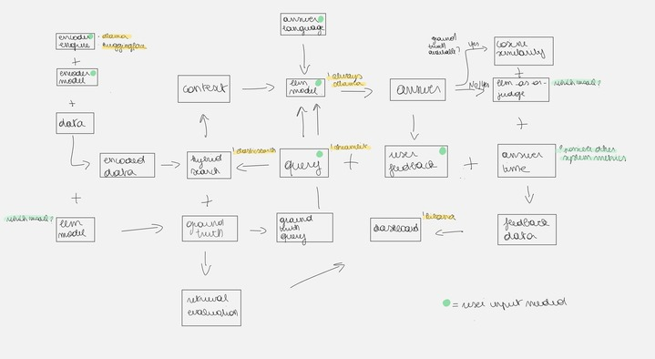
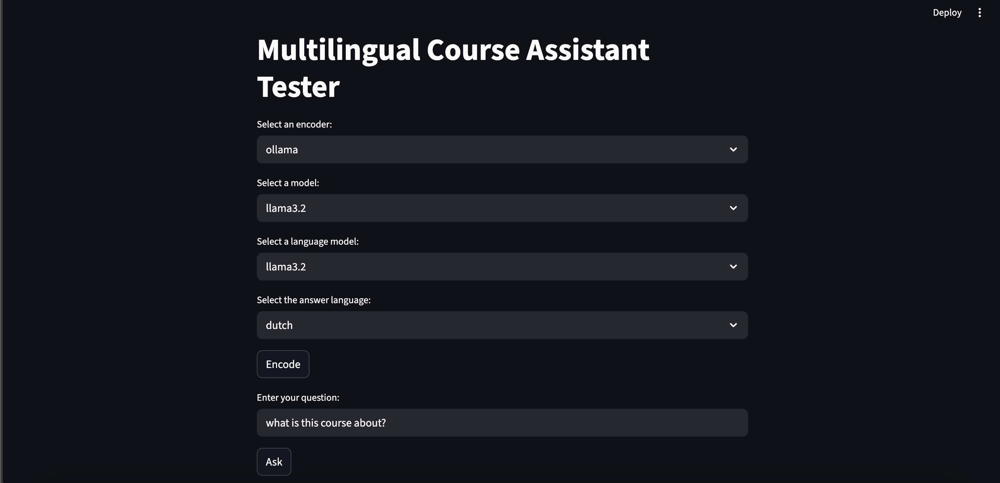
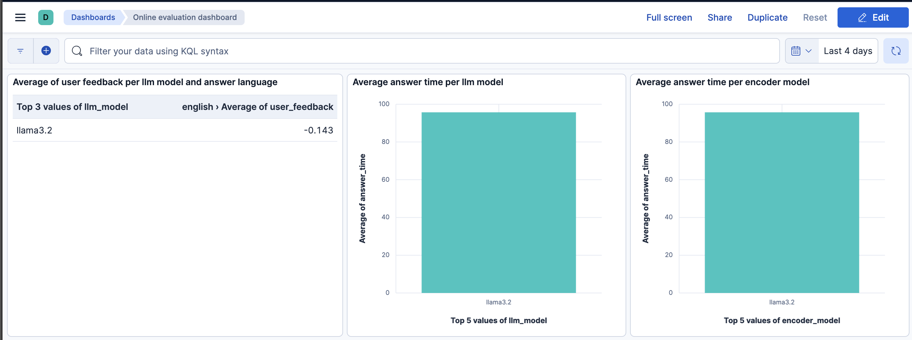
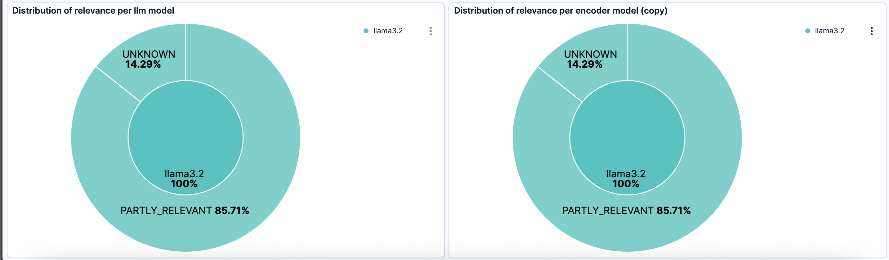

# Multilingual Course Assistant Tester
# Problem description
New models are being produced every day, but how do you know which works best at your company? This repo has been set-up as a way to test the performance of different models on a multilingual course assistant task. It uses a combination of Elasticsearch, Kibana, and Ollama to provide a user interface for testing and evaluating the models.

The code was written in such a way that it can be used to test any model in any context (i.e. new data set). More on this later. 

Everything is run in Docker containers, so you can easily set it up on your local machine or on a server. We do not use external services like OpenAI or Cohere.

# Diagram
There are many moving parts in this application, so here is a diagram to help you understand how they all fit together:



We will use this to discuss the inner workings of the application and how they **relate to the evaluation criteria of the project (in bold)**. Follow these instructions to execute the full scope of the project and evaluate the performance of the models (**this is the reproducibility aspect with dataset, code and dependencies**).

# Getting Started
To get started, you need to have Docker installed on your machine. Once you have Docker installed, you can run the following command in the terminal to start the application (**this is full containerization**):

```bash
docker-compose up --build
```

This command will build the Docker images and start the containers defined in the `docker-compose.yaml` file. It will take a while to download the images and set up the containers, so please be patient.

The following Docker containers are started:
- es01: This is the container that runs the Elasticsearch service, which is used to store and search the data.
- kibana: This is the container that runs the Kibana service, which is used to visualize the data in Elasticsearch and perform the monitoring.
- ollama: This is the container that runs the Ollama service, which is used to answer the questions from the Streamlit app.
- streamlit: This is the container that runs the Streamlit app, which provides a user interface for testing and evaluating the models.
- setup: This makes sure there is a connection between the kibana and elasticsearch container. 

*To make use of the reciprocal rank fusion (RRF) algorithm, go to localhost:5601 and log in with username `elastic` and password `password` to access Kibana. Then click on 'Kibana' > 'Stack Management' > 'License Management' and activate a 30-day trial license.*

# Application
Go to localhost:8501 to access the Streamlit app (**this is an interface through UI**). Here you can chose both the encoder engine (`ollama` or `huggingface`) and the llm used for answering the query (always `ollama`). In addition, you can chose the answer language. 

If your press 'Encode' the app reads the data from the `data` folder and loads it into Elasticsearch (in the `llm-doc` index, **this is the automated ingestion pipeline**). Lastly, it adds a dense vector representation of the questions to the index the selected encoder model.

After it has finished encoding (this can take a while depending on your machine), you can start asking questions using the interface below. 



You can then ask questions in the text box. The app will use the selected encoder model to encode the question and then perform a search in Elasticsearch to find the most relevant documents. These are supplied as contex to the LLM, which will then generate an answer based on the context documents and the question (**this is the retrieval flow with both knowledge base and LLM**). 

The number of context documents to retrieve and the field to encode are hardcoded in the app.py file. But you could modify these to suit your needs. We implemented reciprocal rank fusion (RRF) to rerank the documents based on the hybrid search using both vector and full-text search (**these are the reranking and hybrid search best practices**). We chose not to implement chunking, since the data is already in pretty small chunks. In addition, we did not implement user query rewriting, since this would require even more resources. 

All this is done by assembling an object of the `RAG` class, which is defined in the `rag.py` file. This class handles the connection to Elasticsearch, the encoding of the documents (`.fit()` method), and the retrieval of the most relevant documents based on the question (`.predict()` method).

## Online evaluation
Before presenting you the answer, we also use the select llm model to evaluate the relevance using the `relevance()` function. 

After your answer is presented, you can provide feedback on the answer by clicking the +1 or -1 buttons. This feedback, together with the original query, the answer, the llm feedback and the answer time (as well as details on the encoder and llm model) are saved in Elasticsearch in the `app-results` index.

## Dashboard
You can monitor the performance of the application using the Kibana dashboard (**monitoring by collecting user metrics and having a dashboard with at least 5 charts**). 

To view the dashboard, you must first use the application to generate some data. Then, in Kibana go to 'Stack Management' > 'Saved Object' (under 'Kibana') > 'Import' and upload the `kibana-dashboard.ndjson` file. This will create the dashboard below and the underlying index patterns




# Offline evaluation
The app only performs fitting of the rag, prediction and online evaluation. Offline evaluation during fitting, for example, would take too long to run on a local machine. Therefore, we have provided a separate script for offline evaluation.

First, you need to make a virtual environment and install the required packages. You can do this by running the following commands in your terminal:

```bash
python -m venv venv
source venv/bin/activate  # On Windows use `venv\Scripts\activate`
pip install -r requirements.txt
```

Then, you can run the `test.py` script. This script will generate the ground truth data and perform the offline evaluation of the rag. 

Evaluation of retrieval is done through the calculation of the hit rate and the mean reciprocal rank (MRR). Evaluation of the rag is done through calculation of the cosine similarity and using the llm to judge the relevance of the answers. 

For ease-of-use, the ground truth data is already provided in the `data` folder. You can modify the script accordingly. Beware, this will still take a very long time to run on a local machine, so it is recommended to run them on a server with sufficient resources.

The resulting metrics are saved in ElasticSearch. In Kibana, go to the 'Management' section (by clicking the hamburger menu in the top left corner) and then click on 'Stack Management'. Then under 'Data', click on 'Index Management'. You should see the `rag-evaluation` index. Click on it and then 'Discover' to see the results of the offline evaluation.

# Conclusion
This project provides a way to test the performance of different models on a multilingual course assistant task.

It uses a combination of Elasticsearch, Kibana, and Ollama to provide a user interface for testing and evaluating the models.

Through using the application using multiple combinations of encoders and llms, you can evaluate the performance both llm and retrieval. Results are automatically pushed to Elasticsearch indices. If you want, you could modify the dashboard to also include the results of the offline evaluation, providing a complete overview of the performance of the models (**this is the llm and retrieval evaluation**).